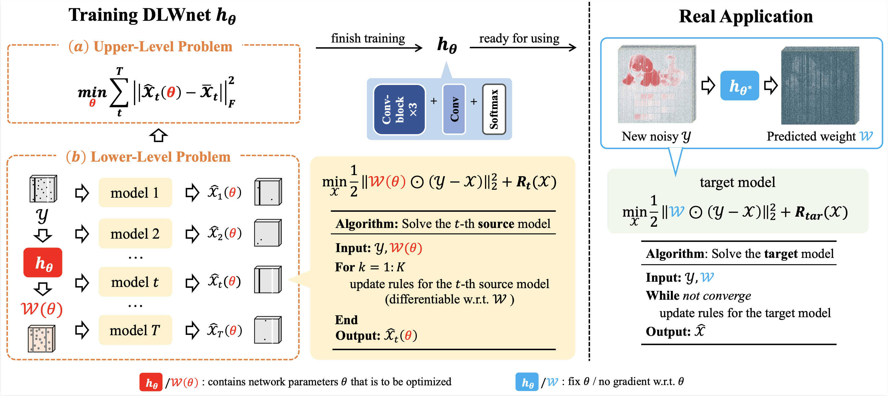
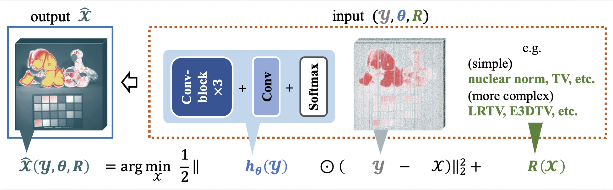
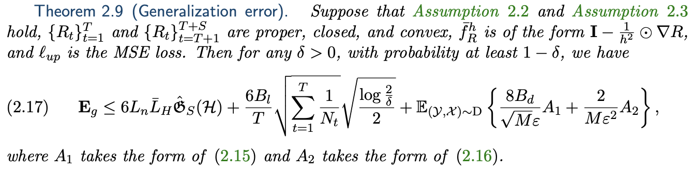
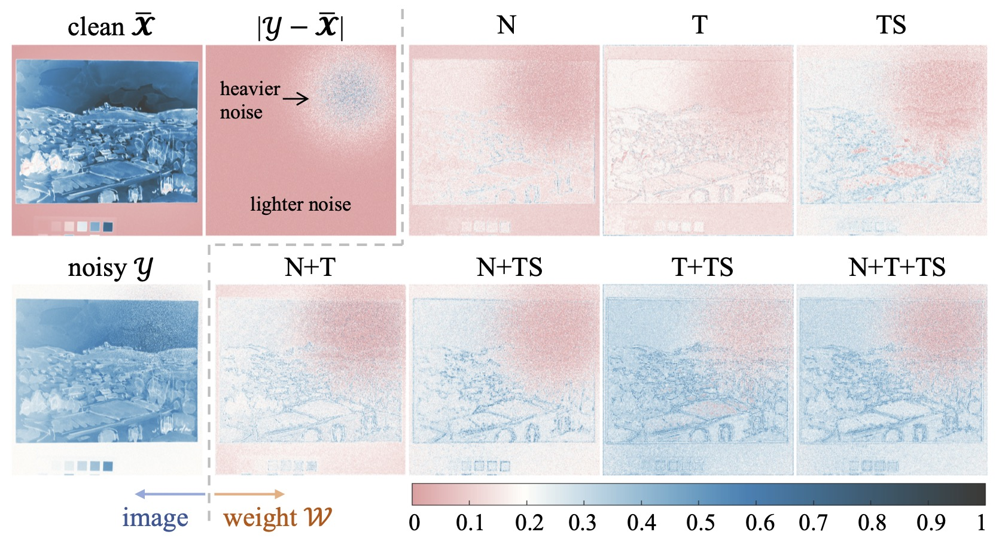
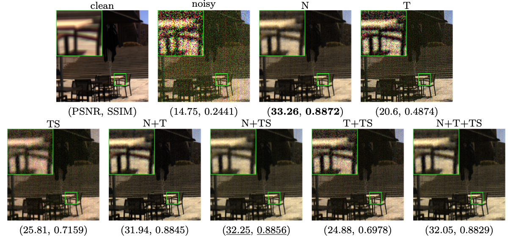

# A Data-driven Loss Weighting Scheme across Heterogeneous Tasks for Image Denoising (SIAM Journal on Imaging Sciences 2026)

    Xiangyu Rui, <a href="https://github.com/xiangyongcao">Xiangyong Cao</a>, <a href="https://github.com/zhaoxile">Xile Zhao</a>, <a href="https://gr.xjtu.edu.cn/web/dymeng">Deyu Meng</a>, <a href="https://www.math.hkbu.edu.hk/~mng/">Michael K. NG</a>

Paper: [arXiv](https://arxiv.org/abs/2301.06081)

## 1. Brief introduction of this work
### 1.1 Overview

Figure 1: Overview of the proposed DLW scheme. The left part illustrates the training of the weight function hθ (DLWnet). This process consists of a lower-level problem solving T heterogeneous image denoising problems (all using the same hθ) and an upper-level problem minimizing the distance between the restored image X(θ) and the ground-truth image X. The right part shows the application of the trained hθ. In this stage, hθ predicts the weight for a noisy image, which is then used in a target image denoising model, helping the model achieve better performance.

Figure 2: The solution X to a denoising problem is implicitly related to three elements. They are the noisy image Y, the network parameter θ (because W= hθ(Y)) and the regularization term R(X). This fact is the basis of the proposed DLW scheme.

### 1.2 Theoretical results

Our main theory about the model-level DLWnet generalization.

### 1.3 Visualization of weights

Figure 3: Visual comparison of the weights W predicted by different types of DLWnets. There are two observations: 1) All seven DLWnets can recognize the regions with heavier noise and assign smaller weights to them, clearly demonstrating the denoising assistance capability of DLWnet. 2) DLWnets additionally extract certain image structures, and the extracted structures vary across different DLWnets.

### 1.4 Denoising examples

Figure 4: Denoising results (pesudo-color image) of DLW-NN on image “BGU 0522-1136” of ICVL dataset. The noisy type is “mixture”.

## 2. Training
### 2.1 Run the code
run ``python3 train_<modelname>.py`` to train different DLWnets.

### 2.2 Trained networks
In the ``./cks`` folder, we have stored the pre-trained seven DLWnets for direct use.

## 3. Connections
<a href="mailto:xyrui.aca@gmail.com">xyrui.aca@gmail.com</a> 
